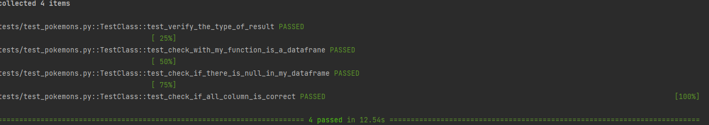

# Testes
Este repositório contém informacões básicas sobre testes unitários, e para melhor exemplificar a documentacão, conta com código de exemplo

#Estrutura de arquivos
```
py-test/
│
└── codigo/
│       └── poke.py
└── tests/
        └── __init__.py
        └── test_pokemons.py
```
# Testes em Python
Os testes é uma prática muito importante no momento do desenvolvimento de algum software ou produto de dados, 
e aderindo a esse conceito que é possível verificar se todas as partes do seu código está se comportando da maneira 
que gostaria.
Testar em python é um tópico que pode vir com uma enorme complexidade, mas é possível começar a testar em python no 
momento que você quiser a partir de alguns conceitos, e com o tempo, aumentando a complexidade do seu código de teste.

## Testes manuais vs Testes automatizados

Como o próprio nome induz, o teste manual é feito por uma pessoa e manualmente. Esse tipo de teste faz com que a pessoa
teste cada pedacinho do seu código analizando e sempre atento as condições que o teste impõe.
O teste manual costuma possuir um baixo valor de investimento em sua implementação, mas em compensação, acaba sendo mais lento em sua execução
e também por ser operado por uma pessoa, está sujeito a falhas.

O teste automatizado traz a praticidade de ter um script que consegue testar as partes do código de forma totalmente autonoma, 
sem a necessidade de um humano para rodar cada pedaço de código. Como nem tudo é um mar de rosas, o teste automarizado costuma ser bem mais caro, pois depende de uma ferramenta especifica para rodar os testes.
Além disso, o fator humano não é descartado nesse tipo de teste, é necessário uma pessoa para analisar os outputs e detectar alguma anomalidade.

#Tipos de testes
Existem alguns tipos de testes, e cada um deles possuem uma caracteristica

## Teste unitário
Esse tipo de teste costuma ser feito pela pessoa que está envolvida no projeto, e possui um nível muito baixo do projeto.
Geralmente são feitos de forma isolada, e tem o intuito de testar cada parte do código de forma individual 
para assegurar que todas as partes estão funcionando bem de forma isolada.

**_Podemos pensar da seguinte forma:_** \
Compramos todas as peças para montar um carro, e no momento da montagem não testamos nenhuma parte de forma individual, 
apenas montamos. No final de tudo, no momento de ligar o carro, percebemos que diversas peças estão falhando e o carro não consegue andar devido a esse conjunto de problemas.
Então nos desmontamos o carro por inteiro, trocamos todas as peças e só depois ainda precisamos contar com a sorte de tudo está funcionando. \
Trabalhão né?\
Se tivessemos feito o contrário, testado uma lâmpada, as rodas, o parabrisa, e todas as peças de forma individual, teríamos a certeza do funcionamento daquela peça.

## Teste de integração
Os testes de integração são mais dificeis para serem desenvolvidos e logicamente mais lentos de serem executados. 
Pois agora focam em testar a funcionalidade como o todo, e não mais as unidades de forma individual.\
Seria como se após testar todas as peças do carro de forma individual, agora testamos a funcionalidade de todas as peças em conjunto,
no nosso caso, o carro funcionando

##Teste de ponta a ponta
Esse tipo de teste simulam a experiência do cliente no seu software ou produto de dados, porém a atividade é feito em 
um ambiente de DEV preparado para proporcionar a mesma experiência dos clientes. \
São testes que demoram muito mais para serem desenvolvidos e também executados, visto que englobam uma experiênci, mas em ambiente controlado.\

**_Podemos pensar da seguinte forma:_** \
É como se colocassemos o nosso carro para rodar 10 KM e verificar como é a experiência das partes em funcionamento

# Arrange-Act-Assert
Para a criação de teste, existe uma metodologia que nos ajuda no momento dessa construção a organizar nosso pensamentos
e também a escrita do que desejamos testar. Essa metodologia é chamada de **Arrange-Act-Assert**.

- ***Arrange*** (Organizar): \
A organização, nesse caso, seria focada nos passos preliminares necessários para montar o contexto inicial do teste;
- ***Act*** (Agir): \
Nesse caso seria a ação que parte dos passos organizados na primeira etapa e leva ao que vamos averiguar no final;
- ***Assert*** (Averiguar): \
Nesse caso, averiguarmos que o desfecho trazido pela ação é realmente aquele que esperamos.

# Pytest
O [Pytest](https://docs.pytest.org/en/7.4.x/) é um framework que nos ajuda a realizar os testes que desejamos. Possui diversas extensões para personalizar os testes de acordo com o que desejamos, 
além de ser escalável e com uma utilização bem simples.\
Existem outros frameworks utilizados para teste, mas o pytest foi escolhido pelos motivos descrito acima.

## Instalando o Pytest no seu ambiente virtual 
- Caso não tenha o Pipenv em seu sistema, instale conforme o comando abaixo: \
`pip install pipenv`

- Vá até o diretório do seu projeto e crie um novo ambiente virtual e inicialize o Pipefile: \
`pipenv --python 3.10` \
_Troque o 3.10 para a versão que deseja utilizar_

- Agora instale os pacotes que deseja utilizar no seu ambiente virtual: \
`pipenv install pytest`
- Ative o seu ambiente virtual: \
`pipenv shell `

Para saber mais sobre o ambiente virtual que está criando acesse: https://pypi.org/project/pipenv/

## Utilizando o Pytest em testes unitários
Após o seu ambiente virtual estiver operante, é hora de começar a testar. Mas para isso é necessário seguir 
algumas regras.\
```
└── tests/
        └── __init__.py
        └── test_pokemons.py
```
O bloco de código acima mostra como deve ser a sua estrutura de pastas para que o seu teste rode com sucesso.
- Os testes precisam ser feitos dentro de uma pasta chamada `tests`. 
Caso não crie essa pasta ou coloque o nome errado, os testes não irão funcionar;
- É necessário ter um arquivo `__init__.py`;
- O arquivo onde será desenvolvido o código precisa começar com o prefixo de `test_`.

Como estamos tratando de testes unitários, toda a construção do seu código de teste precisa testar uma parte do 
seu código principal, por exemplo:

O meu aplicativo tem uma função onde eu faço uma requisição de API com um GET:

```
    def GetAllPokemon(self):

        response = requests.get(self.url)
        if response.status_code == 200:
            result = response.json()
        else:
            result = response.content

        return result
```
Eu posso criar um teste para verificar se a resposta que obtenho realmente é o que eu espero:

```
from codigo.poke import Pokemons
import pandas as pd


class TestFunction:
    def test_verify_the_type_of_result(self):
    
        input = 'https://pokemonapi.franciscovaldec.repl.co/pokemon'
        request = Pokemons(input)

        response = test_get_result_from_my_api.GetAllPokemon()
        output = type(list())


        assert output == type(response)
```

Vamos olhar o código para entender o que está acontecendo.\
1. Importo a classe criada no meu produto de dados, no caso, uma API. A classe Pokemon tem um método chamado `GetAllPokemon()`,
e é ela que queremos testar;
2. Definimos uma classe de teste chamada `TestFunction`;
3. Dentro da classe definimos um método (função):
Ao criar uma função para verificar fazer os testes, obrigatóriamente, ela precisa começar possuir o prefixo `test_`.
É possível mudar, mas não abordaremos isso neste momento.
Logo após o prefixo test, tente descrever o que sua função faz. Quanto mais verbosa, melhor. Outra pessoa que pegar o código, precisa entender o que o teste está realizando,
no nosso caso queremos o seguinte resultado `test_verify_the_type_of_result` queremos verificar o tipo do nosso resultado da api.
4. O `assert` funciona como um comparador. Ele compara se output é igual ao resultado que estava esperando. Se for verdadeiro, o seu teste passa, caso contrário significa que há algo de errado na sua aplicação.

Agora que já entendeu, vá até o seu terminal e comande o pytest para rodar os testes:\
`pytest -v`
Caso tenha sucesso na sua requisição, você terá um output parecido com este abaixo \


